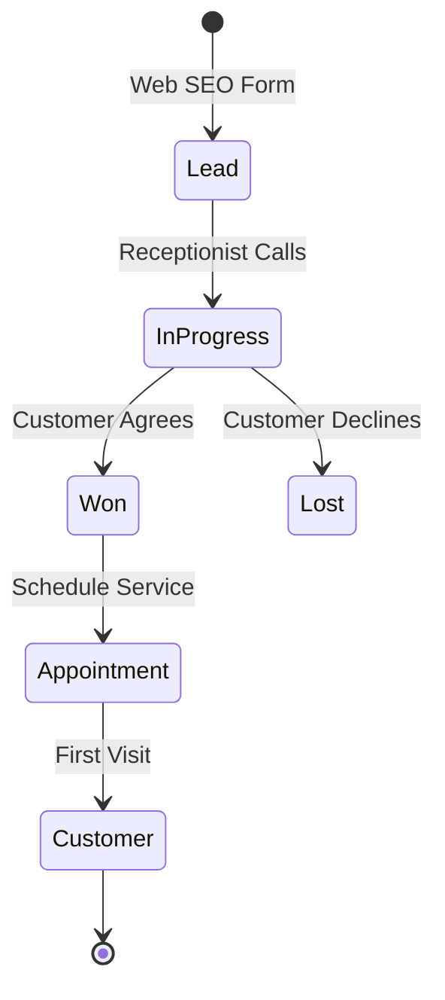
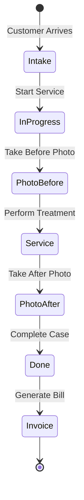
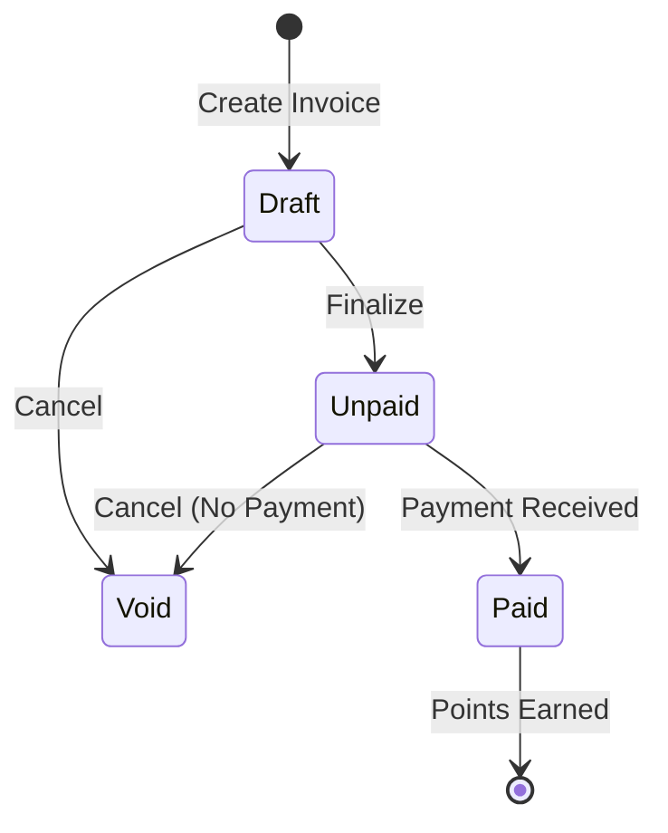

# CRM SPA System Documentation

## System Overview

The CRM SPA system is a comprehensive customer relationship management solution designed specifically for beauty spas specializing in lip and eyebrow tattooing services. The system follows a microservice architecture pattern with multi-schema database design.

## Architecture

### Microservice Modules

1. **Core Module**

   - User authentication and authorization
   - Customer management
   - Loyalty program (tiers and points)

2. **Lead Module**

   - Lead capture and tracking
   - Appointment scheduling
   - Lead conversion funnel

3. **Service Module**

   - Service catalog management
   - Case management (service sessions)
   - Photo documentation
   - Technical notes

4. **Billing Module**

   - Invoice generation
   - Payment processing
   - Points calculation
   - Promotions

5. **Audit Module**
   - System audit logs
   - Task management
   - Retouch scheduling

### Database Schema Design

```
crm_spa (database)
├── core (schema)
│   ├── role
│   ├── staff_user
│   ├── customer
│   └── tier
├── lead (schema)
│   ├── lead
│   └── appointment
├── service (schema)
│   ├── service
│   ├── customer_case
│   ├── case_service
│   ├── technician_note
│   └── case_photo
├── billing (schema)
│   ├── invoice
│   ├── payment
│   ├── point_transaction
│   └── promotion
└── audit (schema)
    ├── audit_log
    ├── task
    └── retouch_schedule
```

## Business Flow

### 1. Lead to Customer Journey



### 2. Service Flow



### 3. Invoice Lifecycle



## API Endpoints Structure (Suggested)

### Core Module

```
POST   /api/auth/login
POST   /api/auth/refresh
GET    /api/users/profile
PUT    /api/users/profile
GET    /api/customers
POST   /api/customers
PUT    /api/customers/{id}
GET    /api/customers/{id}/history
```

### Lead Module

```
GET    /api/leads
POST   /api/leads
PUT    /api/leads/{id}
PUT    /api/leads/{id}/status
GET    /api/appointments
POST   /api/appointments
PUT    /api/appointments/{id}
```

### Service Module

```
GET    /api/services
POST   /api/services
PUT    /api/services/{id}
GET    /api/cases
POST   /api/cases
PUT    /api/cases/{id}
POST   /api/cases/{id}/photos
POST   /api/cases/{id}/notes
```

### Billing Module

```
GET    /api/invoices
POST   /api/invoices
PUT    /api/invoices/{id}
POST   /api/invoices/{id}/payments
GET    /api/points/transactions
POST   /api/points/redeem
GET    /api/promotions/active
POST   /api/promotions/apply
```

## Key Features

### 1. Lead Management

- Capture leads from multiple sources (SEO, Facebook, Zalo)
- Track conversion funnel (NEW → IN_PROGRESS → WON/LOST)
- Prevent spam with unique phone/date constraint
- UTM tracking for marketing analytics

### 2. Appointment System

- No double-booking (EXCLUDE constraint)
- Multiple appointment statuses
- Reminder functionality
- Link to leads or existing customers

### 3. Service Management

- Service categories (LIP, BROW, OTHER)
- Configurable pricing and duration
- Retouch day tracking
- Warranty period management

### 4. Case Documentation

- Before/after photo requirements
- Technical notes with satisfaction ratings
- Contraindication tracking
- Digital consent management

### 5. Billing & Payments

- Multiple payment methods
- Automatic point calculation
- Promotion engine
- Invoice status workflow

### 6. Loyalty Program

- 4-tier system (REGULAR, SILVER, GOLD, VIP)
- Automatic tier upgrades
- Points earning and redemption
- Tier-specific benefits

### 7. Audit & Compliance

- Complete audit trail
- GDPR-ready (photo anonymization)
- Task management
- Retouch reminders

## Security Model

### Role-Based Access Control (RBAC)

| Feature         | Receptionist | Technician      | Manager |
| --------------- | ------------ | --------------- | ------- |
| Lead Management | ✓            | -               | ✓       |
| Customer Data   | ✓            | Read Only       | ✓       |
| Appointments    | ✓            | Own Only        | ✓       |
| Service Cases   | Create/Read  | Update Own      | ✓       |
| Photos          | Read         | Create          | ✓       |
| Billing         | ✓            | -               | ✓       |
| Reports         | Basic        | Own Performance | ✓       |
| Configuration   | -            | -               | ✓       |

### Data Privacy

- Customer phone numbers are normalized and indexed
- Photos can be anonymized on request
- Audit logs track all data access
- Consent tracking for marketing use

## Reporting & Analytics

### Available Views

1. **Daily Revenue** - Revenue summary by day
2. **Monthly Revenue by Service** - Service performance analysis
3. **Lead Conversion Funnel** - Marketing effectiveness
4. **Technician Performance** - Staff productivity metrics
5. **Customer Lifetime Value** - Customer segmentation
6. **Service Popularity** - Service demand analysis
7. **Customer Retention** - Cohort analysis

### KPI Dashboard

- New customers (30 days)
- Lead conversion rate
- Average invoice value
- Service completion rate
- Customer retention rate

## Configuration

### Environment Variables

```properties
# Database
DB_HOST=localhost
DB_PORT=5432
DB_NAME=crm_spa
DB_USER=postgres
DB_PASSWORD=your_password

# Application
APP_PORT=8081
JWT_SECRET=your_secret_key
JWT_EXPIRATION=86400000

# Email
SMTP_HOST=smtp.gmail.com
SMTP_PORT=587
SMTP_USER=your_email
SMTP_PASSWORD=your_password

# File Storage
UPLOAD_DIR=/var/crm/uploads
MAX_FILE_SIZE=10MB
```

### Business Rules Configuration

- Points earning rate: 1 point per 100 currency units
- Retouch reminder: 3 days before due date
- Photo requirements: Both before/after for case completion
- Tier thresholds: Configurable in tier table

## Deployment

### Docker Compose Example

```yaml
version: "3.8"
services:
  db:
    image: postgres:14
    environment:
      POSTGRES_DB: crm_spa
      POSTGRES_USER: postgres
      POSTGRES_PASSWORD: postgres
    volumes:
      - ./db/migration:/docker-entrypoint-initdb.d
    ports:
      - "5432:5432"

  app:
    build: .
    depends_on:
      - db
    environment:
      SPRING_PROFILES_ACTIVE: docker
    ports:
      - "8081:8081"
```

### Production Considerations

1. Use connection pooling (HikariCP)
2. Enable query caching
3. Set up read replicas for reports
4. Implement API rate limiting
5. Use CDN for photo storage
6. Regular backup schedule
7. Monitor slow queries
8. Index optimization

## Maintenance

### Regular Tasks

1. **Daily**

   - Backup database
   - Check failed tasks
   - Monitor error logs

2. **Weekly**

   - Review conversion metrics
   - Update promotion campaigns
   - Check photo storage usage

3. **Monthly**
   - Analyze customer churn
   - Review technician performance
   - Update service pricing
   - Archive old audit logs

### Health Checks

```sql
-- Check system health
SELECT * FROM core.mv_dashboard_kpis;

-- Check pending tasks
SELECT COUNT(*) FROM audit.task WHERE status = 'OPEN' AND due_at < NOW();

-- Check storage usage
SELECT pg_size_pretty(pg_database_size('crm_spa'));
```

## Support

For technical support or questions:

- Check logs in `/var/log/crm-spa/`
- Review audit trail for user actions
- Contact development team for schema changes

## Version History

- v1.0.0 - Initial release with core functionality
- Multi-schema architecture
- Complete RBAC implementation
- Audit trail and compliance features
